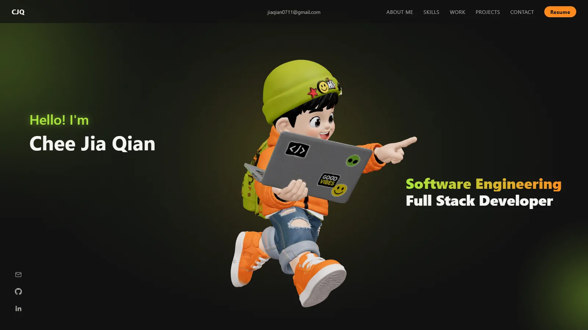
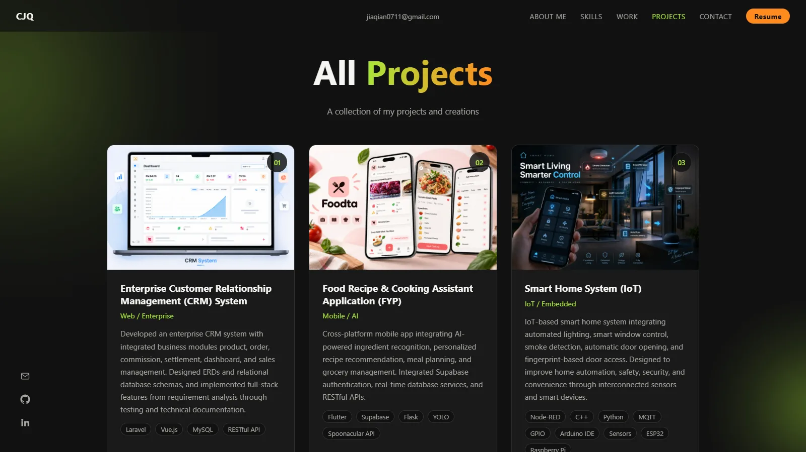

# Chee Jia Qian — Personal Portfolio

An interactive personal portfolio built with **React, TypeScript and Three.js**. It features a draggable 3D character in the hero, a scroll-driven work timeline, and a project gallery — all fed from a single typed content file.

**Live site:** <https://cheejiaqian.vercel.app>





## Features

- **Interactive 3D hero** — a GLB character rendered with React Three Fiber. It rotates on its own, can be dragged to orbit like a figurine, and resumes rotating a few seconds after release. The render loop pauses while the hero is off-screen, and the pixel ratio is capped, to keep scrolling smooth.
- **Scroll-driven timeline** — the Work section draws a line and a glowing dot as you scroll, and lights up each entry when the dot reaches it. Progress is written to CSS variables so the page does not re-render on every frame.
- **Project gallery** — three previews on the home page (with "Read more"), and a dedicated `/projects` page listing every project.
- **Content in one place** — all text, skills, projects and links live in `frontend/src/content/siteContent.ts`, not in the components.
- **Small custom router** — client-side navigation on the History API (`frontend/src/lib/router.ts`), with hash links that scroll to the right section or project. No routing library.
- **Responsive** — layouts use `vw` / `clamp()` and were checked from phone widths up to 2560px.
- **Fast images** — all pictures are WebP (about 100 KB each instead of 1–2 MB PNGs).
- **Downloadable resume** — the navbar's Resume button downloads `frontend/public/resume/cheejiaqian_Resume.pdf`.

## Tech stack

| Area | Tools |
|---|---|
| UI | React 19, TypeScript |
| 3D | three, @react-three/fiber, @react-three/drei |
| Build & tooling | Vite 8, ESLint |
| Styling | Plain CSS with design tokens (CSS custom properties) |

## Getting started

**Requirements:** Node.js 20.19+ or 22.12+ and npm.

```bash
git clone https://github.com/jiaqian2004/personal-portfolio.git
cd personal-portfolio/frontend
npm install
npm run dev
```

Then open <http://localhost:5173>.

| Command | What it does |
|---|---|
| `npm run dev` | Start the dev server with hot reload |
| `npm run build` | Type-check and build the site into `frontend/dist` |
| `npm run preview` | Serve the production build locally (port 4173) |
| `npm run lint` | Run ESLint |

All commands run from the `frontend/` folder.

## Project structure

```
frontend/
├── index.html
├── public/                  Static files, served from the site root
│   ├── img/                 Images (WebP)
│   ├── models/main.glb      3D character for the hero
│   ├── resume/cheejiaqian_Resume.pdf   File behind the Resume button
│   └── favicon.png, apple-touch-icon.png
└── src/
    ├── pages/               HomePage, ProjectsPage
    ├── components/          Hero, About, Work, Projects, Contact, Navbar, ...
    ├── content/siteContent.ts   All site content (typed)
    ├── hooks/               useTimelineScroll
    ├── lib/router.ts        History API router
    ├── three/               3D scene (React Three Fiber)
    └── index.css            Design tokens and shared styles
docs/                        Screenshots used in this README
```

## Editing the content

Almost everything you see on the site is data in `frontend/src/content/siteContent.ts`.

- **Add a project:** append an entry to `projects` with a unique `slug`, a `category`, a `stack`, a `description`, an optional `image` and a list of `links` (`demo` or `github`). It appears on `/projects` automatically; the home page shows the first three.
- **Add or change an image:** put a `.webp` file in `frontend/public/img/` and reference it as `/img/your-file.webp`. Keep the file name's capitalisation identical to the reference — the dev server and Linux hosts are case-sensitive.
- **Change the resume:** replace `frontend/public/resume/cheejiaqian_Resume.pdf`. Keep the file name identical to `RESUME_FILENAME` in `frontend/src/components/Navbar.tsx`: the name visitors save it as comes from the file name (hosts like Vercel send it in a `Content-Disposition` header, which browsers prefer over the link's `download` attribute).

## Deployment

The build output (`frontend/dist`) is a fully static site, so any static host works (Vercel, Netlify, Cloudflare Pages, GitHub Pages, ...).

- **Root directory:** `frontend`
- **Build command:** `npm run build`
- **Output directory:** `dist`
- **Single-page-app fallback:** the host must serve `index.html` for every path. Without it, opening `/projects` directly returns a 404 (navigating there from the home page still works). This repo already contains `frontend/vercel.json` for Vercel. Netlify needs a `_redirects` file containing `/* /index.html 200`; Cloudflare Pages does this by default.

## License

Copyright © 2026 Chee Jia Qian. All rights reserved.

This repository is public so it can be viewed as a portfolio. The code and the content (résumé, photographs, character artwork, 3D model and text) may not be copied, reused or redistributed without my written permission. See [LICENSE](LICENSE).

## Contact

- Email: [jiaqian0711@gmail.com](mailto:jiaqian0711@gmail.com)
- GitHub: [github.com/jiaqian2004](https://github.com/jiaqian2004)
- LinkedIn: [linkedin.com/in/jia-qian-chee-972675291](https://www.linkedin.com/in/jia-qian-chee-972675291/)
